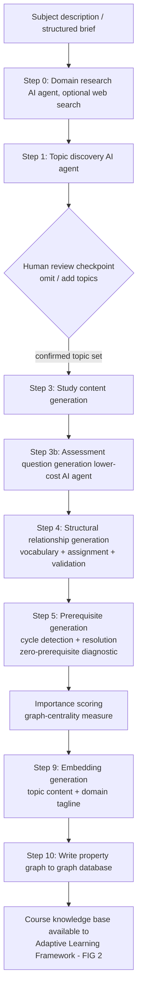
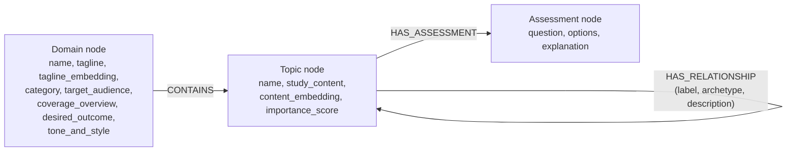
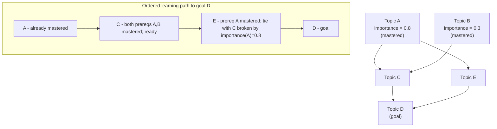
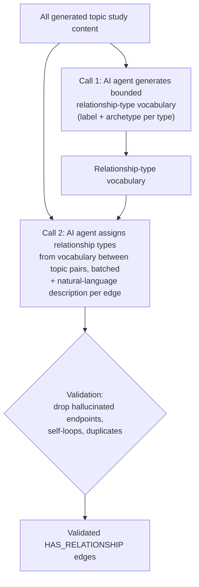
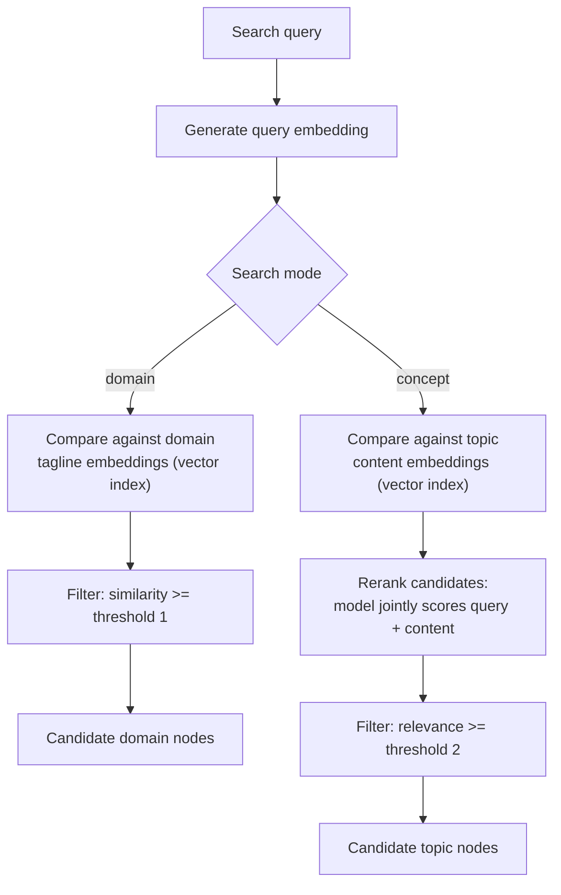
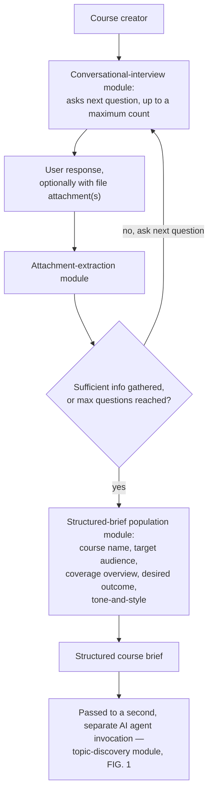
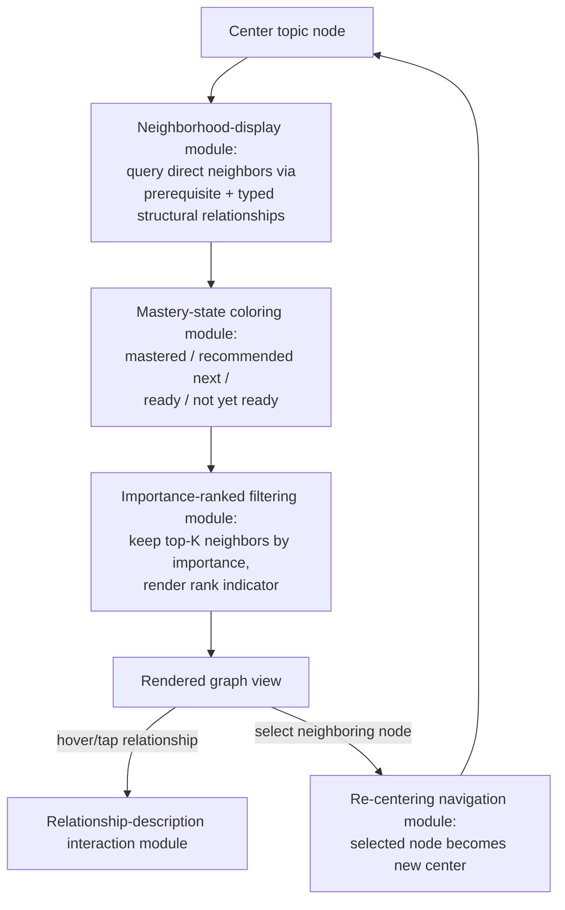

# Non-Provisional Patent Application

## Cross-Reference to Related Application

This application claims the benefit of priority to U.S. Provisional Patent Application No. **63/864,273**, filed **August 14, 2025**, titled "AI-Powered Course Knowledge Base Generation and Adaptive Learning Framework," the entire disclosure of which is incorporated herein by reference.

## Title of Invention
**AI-Powered Course Knowledge Base Generation and Adaptive Learning Framework, with Structural Relationship Graph Generation, Conversational Brief Elicitation, Hybrid Semantic Search, and Interactive Mastery-Aware Knowledge Graph Navigation**

## Field of the Invention
This invention relates to educational technology systems, particularly to computer-implemented methods and systems for (1) generating a course knowledge base as a property graph via artificial intelligence, (2) delivering adaptive, goal-directed learning using prerequisite-driven navigation, (3) generating typed structural relationships among AI-generated content items, (4) eliciting structured course-creation parameters through bounded conversational interaction, (5) performing hybrid semantic search over an AI-generated knowledge base, and (6) interactively navigating a course knowledge base through a mastery-aware graph view.

## Background of the Invention
Traditional learning management systems and online course creation platforms face significant limitations:
- Manual content creation is slow and costly.
- Learning pathways are rigid and do not adapt to individual mastery levels.
- Prerequisite enforcement is minimal or non-existent.
- Adding new subjects requires substantial manual effort.
- Relationships between concepts beyond simple prerequisite ordering (e.g., causal, functional, or hierarchical relationships) are rarely captured, and when captured, are manually authored.
- Locating relevant content within a large, AI-generated body of course material is difficult without a search mechanism tuned to the structure of that content.
- Specifying the parameters of a new course (audience, scope, tone, desired outcome) is itself a manual, unstructured process that does not integrate with automated content generation.
- Graph-based visualizations of course content are typically generic, showing structural connections without regard to an individual user's mastery of the connected material, and without a means of prioritizing which connections are most worth the user's attention.

These limitations reduce scalability, personalization, and the ability to deliver comprehensive coverage in diverse domains.

## Summary of the Invention
The invention comprises six independent but complementary innovations:

1. **Property-Graph KB Generation via AI:** A method for generating a course knowledge base as a graph database structure, populated by querying an AI agent to generate topics, prerequisite relationships, typed structural relationships, study content, and assessments, with automated cycle resolution and centrality-based importance scoring.
2. **Adaptive, Goal-Directed Learning Framework:** A course delivery engine that navigates content using prerequisite relationships, computing an on-demand ordered learning path to any user-selected topic via a topological sort tie-broken by importance score, gating readiness on prerequisite mastery, and re-testing only previously incorrect assessment items.
3. **Structural Relationship Graph Generation:** A two-phase method for generating a bounded, archetype-classified vocabulary of relationship types from a content corpus and then assigning validated typed relationships between content items.
4. **Conversational Course-Brief Elicitation:** A bounded-turn conversational method for gathering structured course-creation parameters from a user, including from multi-modal file attachments, to seed automated content generation.
5. **Hybrid Semantic Search over a Generated KB:** A dual-index search method combining domain-level and content-level vector embeddings with reranking and independent similarity thresholds.
6. **Interactive Mastery-Aware Knowledge Graph Navigation:** A graph-view navigation method that renders a topic's direct neighbors color-coded by the user's mastery-relative state, filters displayed neighbors to those of greatest importance with a rank overlay, presents relationship descriptions on interaction, and re-centers the view on a selected neighbor to enable traversal of the knowledge base.

## Brief Description of the Drawings
- **FIG. 1** — Overall content-generation pipeline, including the human-in-the-loop review checkpoint. (`figures/fig1.svg`)
- **FIG. 2** — Property-graph schema: node types, edge types, and key fields. (`figures/fig2.svg`)
- **FIG. 3** — Worked example of importance-weighted topological goal-path construction. (`figures/fig3.svg`)
- **FIG. 4** — Two-phase structural relationship-type generation flow. (`figures/fig4.svg`)
- **FIG. 5** — Hybrid semantic search flow (dual index, rerank, threshold). (`figures/fig5.svg`)
- **FIG. 6** — Bounded-turn conversational course-brief elicitation flow. (`figures/fig6.svg`)
- **FIG. 7** — Interactive mastery-aware neighborhood graph navigation. (`figures/fig7.svg`)

Formal drawing sheets are provided as black-and-white line art in `figures/fig1.svg` through `figures/fig7.svg`, using the reference numerals given throughout the Detailed Description below. Informal Mermaid sketches of the same figures are retained at the end of this document for reviewer convenience and are not intended for filing.

---

## Detailed Description of the Invention

### Invention 1 — Property-Graph KB Generation

#### Data Structure
Rather than a flat per-topic record, the course knowledge base (KB) is represented as a **property graph** stored in a graph database, as shown in FIG. 2. The graph comprises:

- **Domain nodes (200)** — one per course/subject, with properties including a name, an AI-generated tagline, a category classification, a target audience, a coverage overview, a desired outcome, a tone-and-style descriptor, and a vector embedding of the tagline for search (Invention 5).
- **Topic (Concept) nodes (210, 211)** — one per atomic learning topic, with properties including a name, markdown-formatted study content, a computed importance (centrality) score, a vector embedding of the study content, and a domain identifier.
- **Assessment nodes (220)** — one per assessment question, each connected to its topic node, with properties including the question text, answer options, and an explanation.
- **Prerequisite edges (232, PREREQUISITE_FOR)** — directed edges between topic nodes denoting that one topic must be mastered before another is attempted.
- **Structural relationship edges (234, HAS_RELATIONSHIP)** — directed, typed edges between topic nodes denoting non-prerequisite relationships (e.g., causal, functional, hierarchical), each carrying a relationship-type label, an archetype classification, and a natural-language description (see Invention 3).
- **Assessment edges (236, HAS_ASSESSMENT)** — connecting a topic node to its assessment nodes.
- **Domain-containment edges (230, CONTAINS)** — connecting a domain node to each of its topic nodes.

This graph structure is a generalization of, and superset of, a flat JSON schema: a flat schema can be derived from the graph by traversal, but the graph additionally supports multiple, independently-typed relationships per topic pair, computed graph-theoretic properties (importance), and native vector search.

#### Population Method
Referring to FIG. 1:
1. **Input Subject / Structured Brief (100):** The course-creation user must first pass through a first AI agent invocation conducting the bounded-turn conversational elicitation of Invention 4, which asks the user questions until the scope of the course is clarified and produces a structured, multi-part course description (the brief). This brief is then passed to a second, separate AI agent invocation — the topic-discovery module (104) below — which generates the course itself.
2. **Domain Research module (102), optional:** An AI agent is given the option to autonomously perform a bounded number of web searches to gather current, subject-specific background information when its own knowledge confidence is low, producing a research summary used to inform subsequent steps.
3. **Topic Discovery module (104):** The AI agent is queried, using a prompt template that is invariant across subject matter ("generic"), to return a set of topic names and short descriptions for the subject. The course-creation user does not specify a depth; instead, the agent infers an appropriate depth tier (e.g., introductory, intermediate, advanced, or an adaptive tier self-determined within a bounded range) directly from the structured course description (the brief of Invention 4), and the number of topics generated follows from that inferred tier.
4. **Human Review Checkpoint (106):** The discovered topic set is presented to a human reviewer through a graphical interface. The reviewer may omit topics, add topics, and confirm the set before any further (and more costly) generation proceeds, looping back to the Topic Discovery module (104) if changes are requested. This checkpoint doubles as the primary completeness/relevance validation gate for the pipeline.
5. **Content Generation module (108):** For each confirmed topic, the AI agent generates markdown-formatted study content, in batches, with per-topic fallback regeneration on batch failure or truncation.
6. **Assessment Generation module (110):** For each confirmed topic, a (possibly different, lower-cost) AI agent generates a fixed number of multiple-choice assessment questions, each with an explanation, validated against a fixed schema (exactly one correct option among a fixed number of options).
7. **Structural Relationship Generation module (112):** Typed, non-prerequisite relationships are generated between topics as described in Invention 3 and FIG. 4.
8. **Prerequisite Generation and Cycle-Resolution module (114):** The AI agent generates prerequisite edges between topics. The resulting graph is checked for cycles; where a cycle exists, edges are removed deterministically — according to a fixed rule based on the relative pedagogical "advancement" of the endpoints — until the prerequisite graph is acyclic. Topics left with no prerequisite edges are then re-examined by the AI agent to confirm they are genuinely foundational, and are re-queried if not.
9. **Importance-Scoring module (116):** A graph-centrality measure (e.g., betweenness centrality) is computed over the prerequisite graph and stored as an importance score on each topic node, for later use in goal-path tie-breaking and recommendation (Invention 2).
10. **Embedding Generation module (118):** Vector embeddings are generated for topic study content and for the domain's tagline/summary, for use in semantic search (Invention 5).
11. **Graph-Database Write module (120):** The populated graph is written to a graph database, producing the course knowledge base (122), making it immediately available to the adaptive learning framework (Invention 2).

#### Embodiments
- The graph database may be Neo4j or any other property-graph-capable store; the underlying data may additionally be serialized to JSON, XML, or YAML for interchange.
- The AI agent(s) may be any LLM; different pipeline steps may use different LLMs selected for cost/quality trade-offs (e.g., a lower-cost model for assessment generation and domain metadata than for study-content generation).
- The KB may be used in educational, corporate training, certification, or research contexts.
- The human review checkpoint may be omitted in fully autonomous embodiments, at the cost of reduced pre-generation validation.
- The conversational elicitation of Invention 4 always runs first; the course-creation user must complete it before the system generates the sectioned, complete course description, and its structured brief is the sole input to topic discovery.

---

### Invention 2 — Adaptive, Goal-Directed Learning Framework

#### Core Logic
- Receives a course knowledge base (Invention 1) containing topic nodes, prerequisite edges, study content, and assessment questions.
- Records, per user, a mastery indication for each topic the user has completed.
- Determines **readiness**: a topic is ready to be studied once the user has a recorded mastery indication for each topic connected to it by a direct prerequisite edge. Because a topic can only become mastered once its own direct prerequisites are mastered, readiness composes transitively across the prerequisite graph without requiring an explicit transitive-closure computation at query time.
- Allows the user to select **any** topic in the KB — not only a pre-designated set of goals — as a learning goal.
- On selection of a goal topic, computes the transitive-prerequisite subgraph of that topic and produces an **ordered learning path** by topologically sorting the subgraph, so that every prerequisite topic precedes every topic that depends on it. Where the topological sort has more than one valid next topic at a given step, the topic with the higher precomputed importance score is selected first. FIG. 3 shows a worked example: topics A (300) and B (310) are mastered prerequisites of topic C (320); topic A (300) is also a prerequisite of topic E (330); topics C (320) and E (330) are each direct prerequisites of the selected goal topic D (340). The resulting ordered path (350) is A → C → E → D, with E ordered ahead of any competing tie by virtue of its prerequisite A's higher importance score (0.8 vs. 0.3 for B).
- When no goal is selected, recommends a single next topic by computing, for each ready-but-unmastered topic, the sum of importance scores of all topics transitively unlocked by it that the user has not yet mastered, and recommending the topic with the greatest such sum (a "bottleneck" recommendation).
- Tracks per-question assessment history; on subsequent presentation of a topic's assessment, **excludes questions the user has already answered correctly**, so that only previously incorrect (or never-attempted) items are re-tested.
- Reports a per-topic competency measure as the ratio of correctly answered to total assessment questions for that topic, and a subject-level competency measure as a pooled ratio across all questions in the subject.

#### Algorithms
**Readiness (Frontier) Calculation:**
```
ready(T) = all(mastered(P) for P in direct_prerequisites(T))
```
**Goal-Directed Path Construction:**
```
subgraph(goal) = transitive_prerequisites(goal) ∪ {goal}
path(goal) = topological_sort(subgraph(goal), tie_break = importance desc)
```
**Bottleneck Recommendation (no goal selected):**
```
score(T) = Σ importance(D) for D in transitively_unlocked(T) if not mastered(D)
recommend = argmax(score(T) for T in ready_unmastered_topics)
```
**Re-Test-Only-Incorrect:**
```
questions_to_present(T, user) = all_questions(T) − correctly_answered(T, user)
```
**Competency:**
```
competency(T) = correct_answers(T) / total_questions_presented(T)
subject_competency = Σ correct_answers / Σ total_questions_presented  (pooled across topics)
```

#### Features
- On-demand construction of an ordered learning path to any user-selected topic, rather than a fixed, pre-authored curriculum sequence.
- Deterministic importance-based tie-breaking distinguishes this from probabilistic or purely likelihood-based recommendation approaches.
- Targeted re-testing reduces the number of assessment items a returning user must answer.

#### Embodiments
- Implemented as a web app, mobile app, or desktop application.
- Integrated with any LMS via API.
- Usable for skill training, language learning, or academic subjects.
- Mastery indications may be binary (as in the primary embodiment) or, in alternative embodiments, graded across multiple tiers.

---

### Invention 3 — Structural Relationship Graph Generation

#### Core Logic
Beyond prerequisite ordering, topics in a knowledge base are often connected by other meaningful relationships (e.g., one topic transfers a property to another, one topic is a specialization of another, one topic is a safety consideration for another). Rather than using a fixed, pre-authored relationship vocabulary, this invention generates the vocabulary itself from the content corpus, then assigns relationships from that vocabulary:

Referring to FIG. 4:
1. **Vocabulary-Generation module (410), Call 1:** An AI agent is queried, given the full corpus of generated study content (400) for a subject, to propose a bounded set of relationship types. Each relationship type comprises a short label and an archetype classification selected from a fixed set (e.g., functional, hierarchical, causal, spatial, temporal, safety, other), producing the relationship-type vocabulary (420).
2. **Relationship-Assignment module (430), Call 2:** The AI agent is queried, in batches, using both the corpus (400) and the generated vocabulary (420), to assign relationship types from the vocabulary between pairs of topics, together with a short natural-language description specific to that pairing.
3. **Validation module (440):** Assigned relationships are programmatically checked and discarded if they reference a topic not present in the corpus (a hallucinated endpoint), are self-referential (a topic related to itself), or duplicate an already-assigned relationship between the same pair of topics, producing the validated set of typed relationships (450).

#### Embodiments
- The content items related need not be course topics; the method is applicable to any AI-generated corpus of discrete content items requiring typed structural relationships.
- The archetype set is extensible; a fixed default set is used as one embodiment.

---

### Invention 4 — Conversational Course-Brief Elicitation

#### Core Logic
Rather than requiring a course creator (600) to author a subject description directly, an AI agent conducts a **bounded-turn conversational interview**, as shown in FIG. 6:

1. The conversational-interview module (605) asks the user a sequence of questions, one at a time, up to a fixed maximum number of questions. In one embodiment, this maximum is enforced by instructing the AI agent, via its system-level prompt, to observe the limit (and to ask no question at all if the initial description already suffices), rather than by a hard, code-level counter that would independently terminate the interview.
2. The user response (610) may, at any point, include file attachments (documents, images, or PDFs); the attachment-extraction module (615) extracts information relevant to the course brief from these attachments.
3. A termination-check (620) determines, after each response, whether sufficient information has been gathered to populate the brief, or whether the maximum question count has been reached; if neither, the process loops back to the conversational-interview module (605) to ask the next question.
4. Once terminated, the structured-brief population module (630) populates a **structured, multi-part course description** with a fixed set of fields — course name, target audience, coverage overview, desired outcome, and tone-and-style — from the conversation and extracted attachment content, producing the structured course brief (640).
5. The completed structured brief (640) is passed to a second, separate AI agent invocation — the KB generation method of Invention 1, seeding its topic-discovery module (104, FIG. 1).

#### Embodiments
- The maximum number of interview questions is configurable.
- The structured brief's field set may be extended without altering the interview method itself.

---

### Invention 5 — Hybrid Semantic Search over a Generated KB

#### Core Logic
The knowledge base produced by Invention 1 carries two independent classes of vector embedding — a **domain-tagline embedding** per domain and a **topic-content embedding** per topic. Search operates in one of two modes:

Referring to FIG. 5, a search query (500) is passed to a query-embedding generator (510), and then to one of two modes:
1. **Domain search:** the query embedding is compared against domain-tagline embeddings by a domain comparator (520); results are filtered by a first threshold filter (522).
2. **Topic (concept) search:** the query embedding is compared against topic-content embeddings by a concept comparator (530) to obtain a candidate set; the candidate set is then **reranked** by a reranker (532) that jointly evaluates the query and each candidate's content, and filtered by a second threshold filter (534), independent of the first.

Both modes converge on a common output of filtered candidate nodes (540) returned in response to the query.

#### Embodiments
- The two thresholds may be tuned independently per deployment.
- The embedding and reranking models may be substituted for any comparable models.
- Search may be restricted to a specified domain or set of domains as an optional filter prior to reranking.

---

### Invention 6 — Interactive Mastery-Aware Knowledge Graph Navigation

#### Core Logic
The adaptive learning framework (Invention 2) and the structural relationship graph (Invention 3) together enable a graph-view navigation mechanism distinct from a generic knowledge-graph browser: the displayed graph is limited to a single topic's immediate neighborhood, each neighbor is visually coded by the user's own mastery-relative state with respect to the adaptive learning framework, and the view can be re-centered by direct interaction to traverse the knowledge base one relationship at a time. Referring to FIG. 7:

1. **Neighborhood Display module (700):** For a currently-selected center topic node (705), the module queries the course knowledge base for every topic node directly connected to it by a prerequisite relationship (232) or a typed structural relationship (234), in either direction, and displays them as a graph centered on the center topic node.
2. **Mastery-State Coloring module (710):** Each displayed neighboring topic node is assigned one of at least four mastery-relative visual states with respect to the user — mastered (720), recommended next (722), ready to be studied (724), or not yet ready (726) — determined according to the adaptive learning framework of Invention 2, and rendered with a visual encoding (e.g., color) corresponding to its assigned state.
3. **Importance-Ranked Filtering module (730):** The displayed neighboring topic nodes are optionally filtered to a fixed number having the greatest precomputed importance score (Invention 1), with a numeric rank indicator rendered on each retained node reflecting its relative importance ranking among the displayed neighbors.
4. **Relationship-Description Interaction module (735):** Responsive to a user interaction (e.g., hover or tap) with a displayed relationship, the natural-language description (234) associated with that relationship is presented to the user.
5. **Re-Centering Navigation module (740):** Responsive to a user selection of a displayed neighboring topic node, the module designates the selected node as the new center topic node (705), repeating steps 1–4 for its own immediate neighborhood — enabling the user to traverse the knowledge base by following structural and prerequisite relationships one node at a time, rather than browsing a static, undifferentiated view of the full graph.

#### Embodiments
- The mastery-relative visual states may be encoded by color, icon, shading, or any other visual distinction.
- The fixed number of retained neighbors in the Importance-Ranked Filtering module (730) is configurable.
- Visibility of neighboring topic nodes may be independently toggled by mastery-relative state, and visibility of prerequisite relationships may be independently toggled separately from typed structural relationships.
- The center topic node (705) may be re-centered by means other than direct node selection, e.g., a search query or a programmatic navigation request.

---

## Claims

### Claim Set 1 — Property-Graph KB Generation

1. A computer-implemented method for generating a course knowledge base as a property graph, comprising:
    - receiving a subject description;
    - querying an AI agent, using a subject-agnostic prompt, to generate a set of topic nodes for the subject;
    - presenting the set of topic nodes to a human reviewer via a graphical interface prior to further generation, the reviewer being permitted to omit or add topic nodes;
    - responsive to reviewer confirmation, querying the AI agent to generate, for each confirmed topic node, study content and one or more assessment questions;
    - querying the AI agent to generate a bounded vocabulary of relationship types, each relationship type comprising a label and an archetype classification, from the generated study content across the confirmed topic nodes;
    - querying the AI agent to assign, between pairs of the confirmed topic nodes, a relationship type selected from the generated vocabulary, and validating the assigned relationships by removing relationships referencing a topic node not among the confirmed topic nodes, self-referential relationships, and duplicate relationships;
    - querying the AI agent to generate prerequisite relationships between the confirmed topic nodes, identifying cycles among the generated prerequisite relationships, and deterministically removing edges from any identified cycle according to a fixed rule until no cycles remain;
    - computing, for each topic node, an importance score based on a graph-centrality measure of the topic node within the prerequisite relationships; and
    - storing the topic nodes, study content, assessment questions, relationship types, prerequisite relationships, and importance scores as nodes and edges of a property graph in a graph database.

2. The method of claim 1, further comprising querying the AI agent to determine, for a topic node assigned zero prerequisite relationships, whether the topic node is foundational to the subject, and if not, re-querying the AI agent to generate at least one prerequisite relationship for the topic node.

3. The method of claim 1, wherein the subject-agnostic prompt used for topic-node generation is invariant across subject descriptions.

4. The method of claim 1, further comprising generating vector embeddings of the study content and storing the vector embeddings on their corresponding topic nodes in the graph database.

5. The method of claim 1, wherein the assessment questions are generated by querying a second AI agent distinct from the AI agent used to generate study content.

6. A computer-readable medium storing a course knowledge base generated according to the method of claim 1.

### Claim Set 2 — Adaptive Learning Framework

7. A computer-implemented method for delivering adaptive online learning using a course knowledge base comprising topic nodes connected by prerequisite relationships, comprising:
    - recording, for a user, a mastery indication for each of a plurality of topic nodes;
    - determining, for a given topic node, that the user is ready to study the given topic node when the user has a recorded mastery indication for each topic node connected to the given topic node by a direct prerequisite relationship;
    - responsive to a user selection of any topic node in the course knowledge base as a learning goal, identifying a transitive-prerequisite subgraph of the selected topic node, and generating an ordered learning path through the subgraph by topologically sorting the subgraph such that each topic node precedes every topic node for which it is a prerequisite;
    - where two or more topic nodes are available to be ordered next in the topological sort, selecting among them using a precomputed importance score associated with each topic node; and
    - presenting the ordered learning path to the user.

8. The method of claim 7, further comprising: presenting assessment questions associated with a topic node to the user; recording the mastery indication for the topic node responsive to the user correctly answering an assessment question; and, upon a subsequent presentation of assessment questions for the same topic node, excluding assessment questions the user has previously answered correctly.

9. The method of claim 7, further comprising, when no learning goal is selected, recommending a topic node to the user by computing, for each topic node not yet mastered by the user and having a recorded mastery indication for its direct prerequisites, a sum of the importance scores of all topic nodes transitively reachable from it via prerequisite relationships that the user has not yet mastered, and recommending the topic node having the greatest computed sum.

10. The method of claim 7, wherein the mastery indication is a binary indication that the user has mastered the topic node.

11. The method of claim 7, further comprising computing a competency measure for a topic node as a ratio of correctly answered assessment questions to total assessment questions presented for that topic node.

12. A computer system configured to implement the method of claim 7, operable with any course knowledge base conforming to the property-graph structure of claim 1.

### Claim Set 3 — Structural Relationship Graph Generation

13. A computer-implemented method for generating typed relationships among a set of AI-generated content items, comprising:
    - querying an AI agent to generate a bounded vocabulary of relationship types from a corpus of content items, each relationship type comprising a label and an archetype classification selected from a fixed set of archetypes;
    - querying the AI agent, in batches, to assign relationship types selected from the generated vocabulary between pairs of content items, together with a natural-language description of each assigned relationship; and
    - validating the assigned relationships by discarding relationships that reference a content item not present in the corpus, relationships between a content item and itself, and duplicate relationships between the same pair of content items.

14. The method of claim 13, wherein the fixed set of archetypes includes at least functional, hierarchical, causal, spatial, temporal, and safety classifications.

15. The method of claim 13, wherein the content items are topic nodes of a course knowledge base.

16. A computer-readable medium storing typed relationships generated according to the method of claim 13.

### Claim Set 4 — Conversational Course-Brief Elicitation

17. A computer-implemented method for eliciting a structured course-creation brief via conversational interaction, comprising:
    - conducting, via an AI agent, a bounded-turn conversational interview with a user, the interview limited to a maximum number of interview questions;
    - accepting, during the interview, one or more file attachments from the user, the file attachments comprising at least one of a document, an image, or a portable document format file;
    - extracting information relevant to the course-creation brief from the accepted file attachments;
    - populating a structured brief comprising a plurality of fixed fields, including a target audience, a coverage overview, a desired outcome, and a tone-and-style descriptor, from the conversational interaction and the extracted information; and
    - providing the structured brief as input to a course-knowledge-base generation process.

18. The method of claim 17, wherein the course-knowledge-base generation process comprises the method of claim 1.

19. The method of claim 17, wherein the AI agent determines, after each user response, whether sufficient information has been gathered to populate the structured brief, and terminates the interview prior to reaching the maximum number of interview questions if so.

### Claim Set 5 — Hybrid Semantic Search over a Generated KB

20. A computer-implemented method for searching a course knowledge base generated by an AI agent, the course knowledge base comprising a plurality of domain nodes each associated with a summary embedding, and a plurality of topic nodes each associated with a content embedding, the method comprising:
    - receiving a search query;
    - generating a query embedding from the search query;
    - responsive to a first search mode, comparing the query embedding against the summary embeddings to identify a set of candidate domain nodes, and filtering the set of candidate domain nodes by a first similarity threshold;
    - responsive to a second search mode, comparing the query embedding against the content embeddings to identify a set of candidate topic nodes, reranking the set of candidate topic nodes using a reranking model that jointly evaluates the search query and content of each candidate topic node, and filtering the reranked candidate topic nodes by a second similarity threshold; and
    - returning the filtered candidate nodes in response to the search query.

21. The method of claim 20, wherein the first similarity threshold and the second similarity threshold are independently configured.

22. The method of claim 20, wherein the course knowledge base is generated according to the method of claim 1.

### Claim Set 6 — Interactive Mastery-Aware Knowledge Graph Navigation

23. A computer-implemented method for navigating a course knowledge base via an interactive graph view, the course knowledge base comprising topic nodes connected by prerequisite relationships and typed structural relationships, the method comprising:
    - displaying a graph view centered on a currently-selected topic node, the graph view including each topic node directly connected to the currently-selected topic node by a prerequisite relationship or a typed structural relationship, in either direction;
    - determining, for each displayed neighboring topic node, a mastery-relative visual state selected from at least four states: mastered by the user, recommended next, ready to be studied, and not yet ready to be studied;
    - rendering each displayed neighboring topic node according to its determined mastery-relative visual state; and
    - responsive to a user selection of a displayed neighboring topic node, re-centering the graph view on the selected topic node and displaying the topic nodes directly connected to it, thereby enabling the user to navigate the course knowledge base by traversing structural and prerequisite relationships one topic node at a time.

24. The method of claim 23, further comprising filtering the displayed neighboring topic nodes to a fixed number having the greatest precomputed importance score, and rendering a numeric rank indicator on each retained neighboring topic node reflecting its relative importance ranking among the displayed neighbors.

25. The method of claim 23, further comprising independently toggling the visibility of neighboring topic nodes by mastery-relative visual state, and independently toggling the visibility of prerequisite relationships separately from typed structural relationships, within the graph view.

26. The method of claim 23, further comprising, responsive to a user interaction with a displayed typed structural relationship, presenting a natural-language description associated with that relationship.

27. The method of claim 23, wherein the mastery-relative visual state is determined according to the method of claim 7, and the precomputed importance score is computed according to the method of claim 1.

28. A computer system configured to implement the method of claim 23.

---

## Technical Advantages
- Separates KB generation, the adaptive learning framework, structural relationship generation, conversational elicitation, hybrid search, and graph navigation into independently valuable and independently licensable components.
- Reduces content-creation time from months to hours, with a single human review checkpoint rather than manual authoring throughout.
- Captures non-prerequisite structural relationships between topics without requiring a pre-authored relationship taxonomy.
- Deterministic cycle resolution and a zero-prerequisite diagnostic pass improve the reliability of AI-generated prerequisite graphs without human intervention.
- Goal-directed path construction adapts to any topic the user chooses, rather than a fixed set of pre-authored learning tracks, and is deterministic rather than probabilistic.
- Targeted re-testing of only previously incorrect assessment items reduces the number of questions returning users must answer.
- Dual-index hybrid search allows a single generated KB to serve both course-discovery and in-course search needs with independently tunable precision.
- Mastery-aware graph navigation directs a user's attention to the neighboring topics most relevant to their own progress, rather than presenting an undifferentiated view of the full graph.
- Scales to any subject matter without architectural changes.

## Industrial Applicability
Applicable to academic institutions, corporate training, certification programs, and self-directed learning platforms, and more generally to any system requiring AI-generated, typed relationship graphs over a content corpus, structured requirements-gathering via conversational interfaces, or hybrid semantic search over AI-generated content.

---

## Abstract
A computer-implemented system generates a course knowledge base as an AI-populated property graph and delivers adaptive, goal-directed learning over it. A first AI agent conducts a bounded conversational interview to elicit a structured course brief, seeding a pipeline that discovers topics subject to human review, generates study content and assessments, derives a bounded, archetype-classified vocabulary of typed structural relationships with validated edges, generates prerequisite relationships with deterministic cycle resolution, computes centrality-based importance scores, and generates vector embeddings. An adaptive learning framework gates topic readiness on prerequisite mastery, constructs an on-demand learning path to any selected topic via an importance-tie-broken topological sort, and re-tests only previously incorrect assessment items. A dual-index hybrid search retrieves domain and topic content by embedding similarity and reranking. An interactive graph view color-codes a topic's neighbors by mastery state and re-centers on a selected neighbor to enable traversal.

---

## Figures

### FIG. 1 — Content-Generation Pipeline, with Human Review Checkpoint



### FIG. 2 — Property-Graph Schema



### FIG. 3 — Importance-Weighted Goal-Directed Topological Path (Worked Example)


*Where the topological sort has two eligible next topics (C and E both become ready once their prerequisites are mastered), the topic reached via the higher-importance prerequisite is ordered first.*

### FIG. 4 — Two-Phase Structural Relationship-Type Generation



### FIG. 5 — Hybrid Semantic Search Flow



### FIG. 6 — Conversational Course-Brief Elicitation Flow



### FIG. 7 — Interactive Mastery-Aware Neighborhood Graph Navigation


